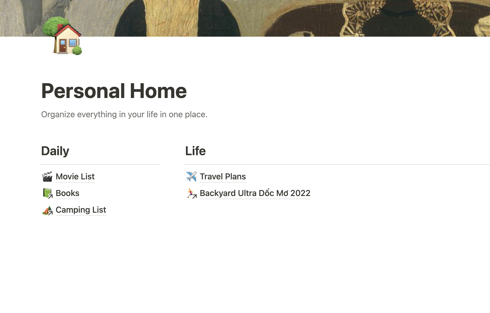

# My wonderful MacOs
My list of application and configuration for my macbook pro :D

*background image : [https://unsplash.com/photos/vRqcK5jydPg](https://unsplash.com/photos/vRqcK5jydPg)*

Insprired from [Nikita Voloboev wonderful list](https://github.com/nikitavoloboev/my-mac-os), I would love to make my own list. First for my personal purpose to go through and listing apps which I use, moreover, I would share my list for ones whom might see it is useful for them.

**Note**: Different from Nikita list which having many paid apps (they really wonderful if you can pay), my list will totally free to use (or having Commutity (free) Edition).

**Contents**

- [My wonderful MacOs](#my-wonderful-macos)
  - [Applications](#applications)
    - [Productivity](#productivity)
      - [Trello](#trello)
      - [Dictionary](#dictionary)
      - [Transmission](#transmission)
    - [Code](#code)
      - [Visual Studio Code](#visual-studio-code)
      - [Sublime Text 3](#sublime-text-3)
      - [Vim](#vim)
      - [Hyperjs - terminal emulator](#hyperjs---terminal-emulator)
      - [Tabby](#tabby)
    - [Social](#social)
      - [Telegram](#telegram)
    - [Writing](#writing)
      - [Macdown](#macdown)
      - [Notion](#notion)
      - [Obsidian](#obsidian)
    - [Design](#design)
      - [Figma](#figma)
    - [Music](#music)
      - [Spotify](#spotify)
      - [Youtube Music](#youtube-music)
    - [Images](#images)
      - [GIF Brewery](#gif-brewery)
    - [Video](#video)
      - [VLC](#vlc)
      - [IINA](#iina)
      - [Davinci Resolve](#davinci-resolve)
    - [Utilities](#utilities)
      - [AppCleaner](#appcleaner)
      - [Calibre](#calibre)
    - [Browsers](#browsers)
      - [Microsoft Edge (Chromnium version)](#microsoft-edge-chromnium-version)
      - [Arc](#arc)
      - [Google Chrome](#google-chrome)
      - [Google Chrome Canary](#google-chrome-canary)
      - [Firefox](#firefox)
    - [Password Manager](#password-manager)
      - [BitWarden](#bitwarden)
  - [Command Line Apps](#command-line-apps)
    - [ncdu](#ncdu)


## Applications

### Productivity
#### Trello
- [Trello](https://trello.com/platforms)
#### Dictionary
- [Dictionary](https://developer.apple.com/documentation/swift/dictionary#//apple_ref/swift/struct/s:Vs10Dictionary) 

Dictionary on Mac can be access from spotlight search, which is very convenient. I use it all the time.


*[Here](https://tinhte.vn/threads/tong-hop-tu-dien-cho-macos.2664045/) is Vietnamese instruction for adding Vietnamese-English dictionary*

#### Transmission
- [Transmission](https://transmissionbt.com/)
### Code
#### Visual Studio Code
- [Visual Studio Code](https://code.visualstudio.com/) is a powerful code editor. After using Golang and VS Code supports it fully, so VS Code becomes my most favorite code editor.
Fix macos key repeating:
```bash
defaults write -g ApplePressAndHoldEnabled -bool false

```
- I use [Ayu](https://github.com/teabyii/vscode-ayu) theme for my VS Code

#### Sublime Text 3
- [Sublime Text 3](https://www.sublimetext.com/3) is my second favorite code editor. It used to be my first favorite. However, vs code with its power take me away from Sublime Text.


#### Vim
- [Vim](https://github.com/vim/vim)
  I prefer using [LazyVim](https://www.lazyvim.org/) for the macos

#### Hyperjs - terminal emulator
- [Hyperjs](https://hyper.is/) is a great terminal emulator with tons of [plugins](https://github.com/bnb/awesome-hyper) for both productivity and entertainment also.
- I also use [Ayu](https://www.npmjs.com/package/hyper-ayu-mirage) theme for Hyper. (Actually I love this color scheme, if possible, I will use this theme everywhere)


#### Tabby
- [Tabby](https://tabby.sh/)
  Open-source terminal emulator
### Social
#### Telegram
- [Telegram](https://telegram.org/) is a messaging platform which is very light-weight and extremely fast
- They allow custom sticker which is a lot
- Their bot [api](https://core.telegram.org/bots) is powerful
#### Zalo
### Writing
#### Macdown - (Not support Appe Sillicon)
- [Macdown](https://macdown.uranusjr.com/) is a wonderful app for Mac which is perfectly clone from loved app Mou. However, Mou now is a paid software.

#### Notion
- [Notion](https://notion.so)

#### Obsidian
> [Obsidian]() is a great writing app that supports markdown and graph
### Design
#### Figma
- [Figma](https://figma.com)

### Music
#### Spotify
- [Spotify](https://www.spotify.com/)
### Images
#### GIF Brewery
- [GIF Brewery](http://gifbrewery.com/)
### Video
#### VLC
- [VLC](https://www.videolan.org/vlc/)
#### IINA
- [IINA](https://lhc70000.github.io/iina/) - beautiful video player which support many different video extensions
  
#### Davinci Resolve
> [Davinci Resolve](https://www.blackmagicdesign.com/products/davinciresolve/) - a great and free software for video editor.
  
### Utilities
#### AppCleaner
> [AppCleaner](https://freemacsoft.net/appcleaner/), this app is very useful for uninstalling app from your Mac. You will need to do that many times.
  
#### Calibre
>[Calibre](https://calibre-ebook.com/) - very useful for reading, convert and edit your ebooks.
  
### Browsers
#### Microsoft Edge (Chromnium version)
> [Microsoft Edge](https://www.microsoftedgeinsider.com/en-us/) - since they release this version, I have set this as my default browser. First, because I don't want using too many product of a single company (like Goole). Moreover, Edge have better performance as I currently feels (and other online benchmark).
#### Google Chrome
> [Chrome](https://www.google.com/chrome/)
#### Google Chrome Canary
> [Chrome Canary](https://www.google.com/chrome/canary/)
#### Firefox
> [Firefox](https://www.mozilla.org/en-US/)

### Password Manager
#### BitWarden
> [Bitwarden](https://bitwarden.com) - I found this is the best solution for password manager cause it is open source, having applications for almost every platforms

## Command Line Apps
### ncdu
> [ncdu](https://dev.yorhel.nl/ncdu) is a commandline tool to check the disk storage usage. You can install `ncdu` using homebrew: `brew install ncdu`

### Programming Font
> [Nerd Fonts](https://www.nerdfonts.com/)


